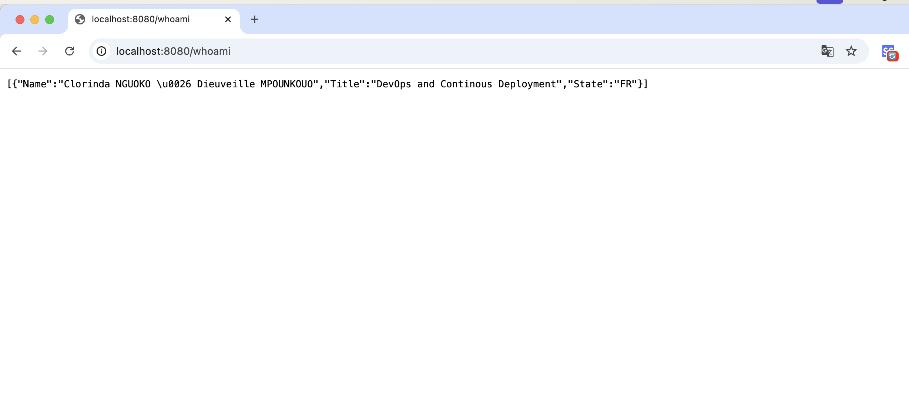

# ST2DCE - DevOps and Continuous Deployment - Project  
**Clorinda NGUOKO - Dieuveille MPOUNKOUO**  

## Part One: Build and Deploy an Application using Docker / Kubernetes and Jenkins Pipeline  

### Architecture Diagram and Tool Chain  
Below is the diagram of our solution, including the toolchain we implemented to achieve full continuous deployment of the application:  

   

Our architecture demonstrates an automated workflow for software development and deployment, commonly referred to as a CI/CD pipeline (Continuous Integration / Continuous Deployment).  

1. **Code Development**:  
   The process begins with the application source code written in **Go**. When a team member pushes code changes to **GitHub**, it triggers the CI/CD pipeline configured in **Jenkins**.  

2. **Continuous Integration via Jenkins**:  
   Jenkins retrieves the code from GitHub, runs unit tests, and, if the tests pass, builds a Docker image containing the updated application.  

3. **Docker Image Creation and Storage**:  
   The Docker image is then pushed to an image registry, such as **Docker Hub**, where it is stored for subsequent use.  

4. **Deployment Orchestration with Kubernetes**:  
   **Kubernetes** handles container orchestration and application deployment. It pulls the Docker image from the registry and deploys it onto a Kubernetes cluster.  

5. **Monitoring and Observability**:  
   - **Prometheus** is used to collect metrics about the state of pods, containers, and the Kubernetes cluster.  
   - **AlertManager**, integrated with Prometheus, generates alerts in case of issues (e.g., a service or pod being offline).  

6. **Visualization with Grafana**:  
   Metrics collected by Prometheus are visualized through **Grafana** dashboards, allowing for easy monitoring and quick decision-making.    

## Customize the application so that the /whoami endpoint displays your team’s name and and deploy it on local docker engine by using Jenkins.

We updated the main.go file by changing the name of the teams members.
```console
package main

import (
	"encoding/json"
	"fmt"
	"log"
	"net/http"
)

type whoami struct {
	Name  string
	Title string
	State string
}

func main() {
	request1()
}

func whoAmI(response http.ResponseWriter, r *http.Request) {
	who := []whoami{
		whoami{Name: "Clorinda NGUOKO & Dieuveille MPOUNKOUO",
			Title: "DevOps and Continous Deployment",
			State: "FR",
		},
	}

	json.NewEncoder(response).Encode(who)

	fmt.Println("Endpoint Hit", who)
}

func homePage(response http.ResponseWriter, r *http.Request) {
	fmt.Fprintf(response, "Welcome to the Web API!")
	fmt.Println("Endpoint Hit: homePage")
}

func aboutMe(response http.ResponseWriter, r *http.Request) {
	who := "EfreiParis"

	fmt.Fprintf(response, "A little bit about me...")
	fmt.Println("Endpoint Hit: ", who)
}

func request1() {
	http.HandleFunc("/", homePage)
	http.HandleFunc("/aboutme", aboutMe)
	http.HandleFunc("/whoami", whoAmI)

	log.Fatal(http.ListenAndServe(":8080", nil))
}
```
To deploy it on our machine we created a Dockerfile

```Dockerfile
FROM golang:1.21.5

RUN mkdir /app

ADD . /app

WORKDIR /app

RUN go build -o main .

EXPOSE 8080

CMD [ "/app/main" ]
```

App customization displaying our team members' names: 
 
