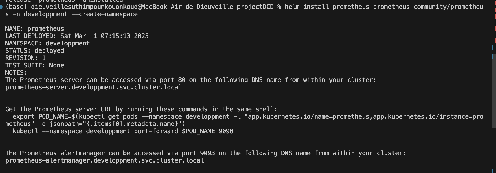
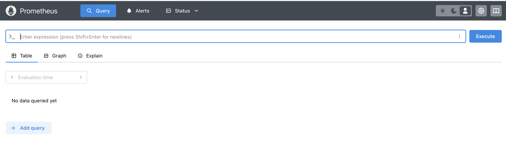
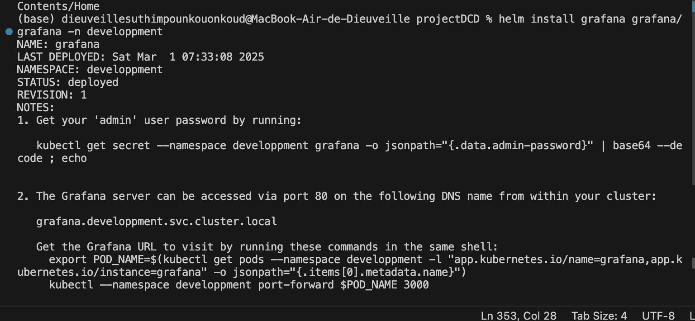
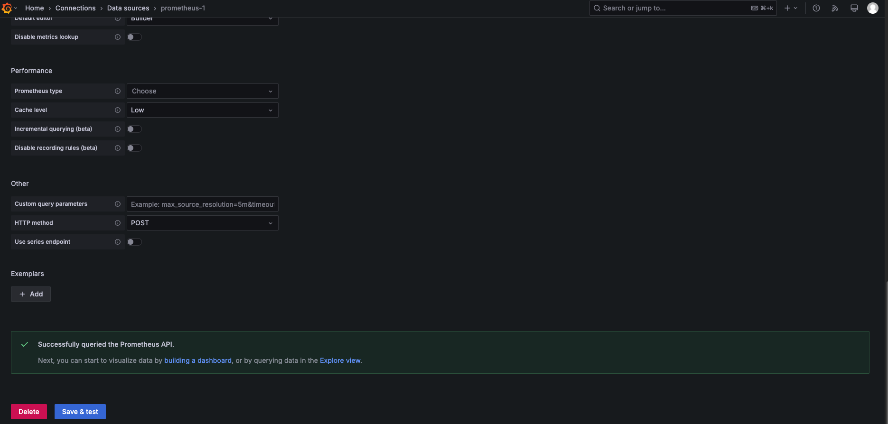
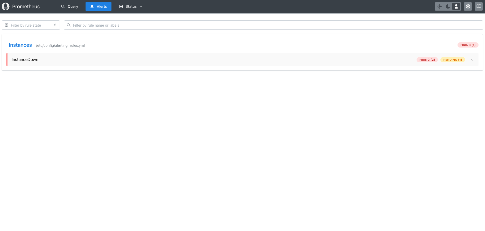
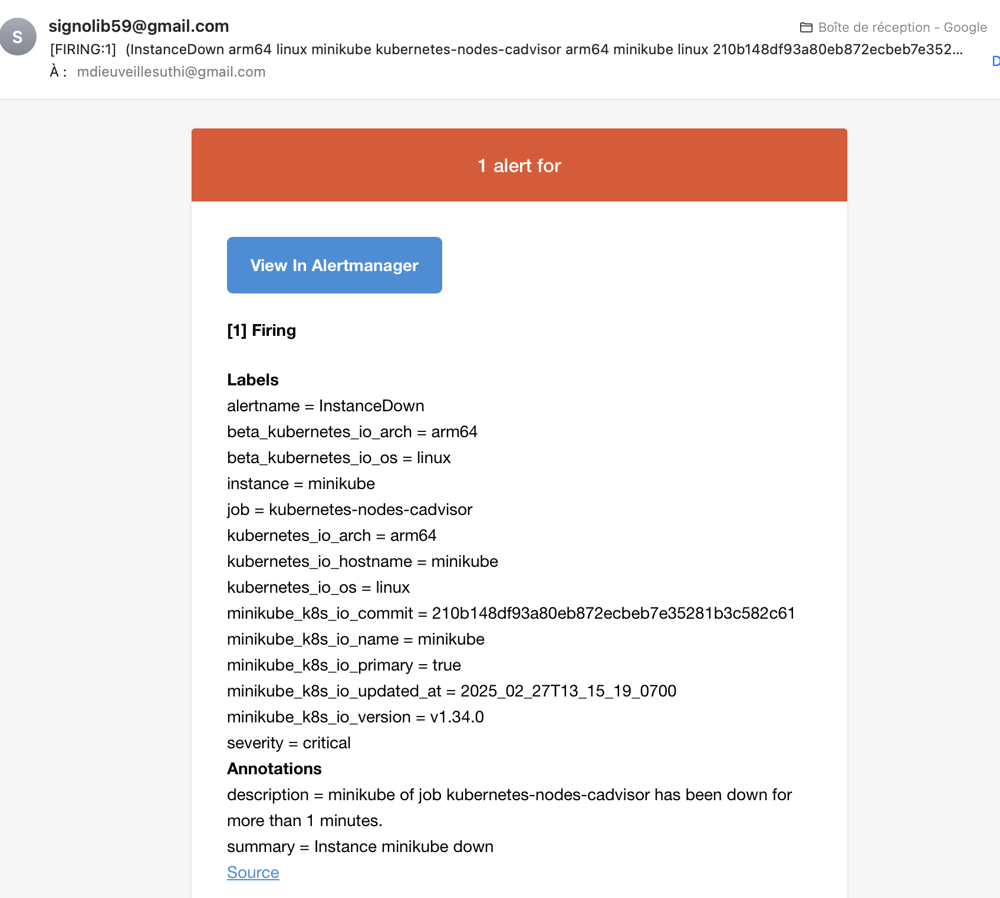
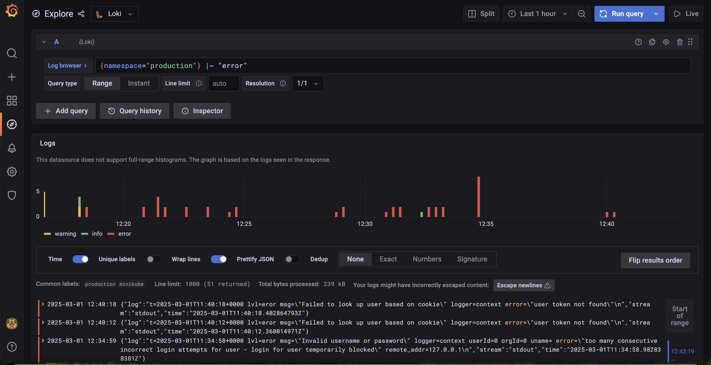

# ST2DCE - DevOps and Continuous Deployment - Project  
**Clorinda NGUOKO - Dieuveille MPOUNKOUO**  

## Part One: Build and Deploy an Application using Docker / Kubernetes and Jenkins Pipeline  

### Architecture Diagram and Tool Chain  
Below is the diagram of our solution, including the toolchain we implemented to achieve full continuous deployment of the application:  

   

Our architecture demonstrates an automated workflow for software development and deployment, commonly referred to as a CI/CD pipeline (Continuous Integration / Continuous Deployment).  

1. **Code Development**:  
   The process begins with the application source code written in **Go**. When a team member pushes code changes to **GitHub**, it triggers the CI/CD pipeline configured in **Jenkins**.  

2. **Continuous Integration via Jenkins**:  
   Jenkins retrieves the code from GitHub, runs unit tests, and, if the tests pass, builds a Docker image containing the updated application.  

3. **Docker Image Creation and Storage**:  
   The Docker image is then pushed to an image registry, such as **Docker Hub**, where it is stored for subsequent use.  

4. **Deployment Orchestration with Kubernetes**:  
   **Kubernetes** handles container orchestration and application deployment. It pulls the Docker image from the registry and deploys it onto a Kubernetes cluster.  

5. **Monitoring and Observability**:  
   - **Prometheus** is used to collect metrics about the state of pods, containers, and the Kubernetes cluster.  
   - **AlertManager**, integrated with Prometheus, generates alerts in case of issues (e.g., a service or pod being offline).  

6. **Visualization with Grafana**:  
   Metrics collected by Prometheus are visualized through **Grafana** dashboards, allowing for easy monitoring and quick decision-making.    

## Customize the application so that the /whoami endpoint displays your team’s name and and deploy it on local docker engine by using Jenkins.

We updated the main.go file by changing the name of the teams members.
```console
package main

import (
	"encoding/json"
	"fmt"
	"log"
	"net/http"
)

type whoami struct {
	Name  string
	Title string
	State string
}

func main() {
	request1()
}

func whoAmI(response http.ResponseWriter, r *http.Request) {
	who := []whoami{
		whoami{Name: "Clorinda NGUOKO & Dieuveille MPOUNKOUO",
			Title: "DevOps and Continous Deployment",
			State: "FR",
		},
	}

	json.NewEncoder(response).Encode(who)

	fmt.Println("Endpoint Hit", who)
}

func homePage(response http.ResponseWriter, r *http.Request) {
	fmt.Fprintf(response, "Welcome to the Web API!")
	fmt.Println("Endpoint Hit: homePage")
}

func aboutMe(response http.ResponseWriter, r *http.Request) {
	who := "EfreiParis"

	fmt.Fprintf(response, "A little bit about me...")
	fmt.Println("Endpoint Hit: ", who)
}

func request1() {
	http.HandleFunc("/", homePage)
	http.HandleFunc("/aboutme", aboutMe)
	http.HandleFunc("/whoami", whoAmI)

	log.Fatal(http.ListenAndServe(":8080", nil))
}
```
To deploy it on our machine we created a Dockerfile

```Dockerfile
FROM golang:1.21.5

RUN mkdir /app

ADD . /app

WORKDIR /app

RUN go build -o main .

EXPOSE 8080

CMD [ "/app/main" ]
```

## Deploy app locally using jenkins
# Setup jenkins

   

  

 

Here is our jenkins pipeline:

```jenkins
pipeline {
    agent any
    environment {
        DOCKER_IMAGE = 'my-go-app'
    }
    stages {
        stage('Clone Repository') {
            steps {
                git branch: 'main', url: 'https://github.com/CloNTCL/projectDCD/'
            }
        }
        stage('Build Docker Image') {
            steps {
                sh 'docker build -t my-go-app .'
            }
        }
        
        stage('Deploy to Local Docker') {
            steps {
                sh 'docker run -d -p 8181:8181 --name go_app my-go-app'
            }
        }
        
        stage('Deploy to Minikube') {
            steps {
                // sh 'eval $(minikube docker-env)'
                // sh 'docker build -t my-go-app .'
                // sh 'minikube image load my-go-app'
                sh 'kubectl apply -f k8s/deployment.yaml'
            }
        }
       
        stage('Deploy to Production') {
            when {
                expression { currentBuild.result == null || currentBuild.result == 'SUCCESS' }
            }
            steps {
                sh 'kubectl apply -f k8s/production-deployment.yaml'
            }
        }
    } // 
} // 

```

App customization displaying our team members' names: 
 

### Update the pipeline to deploy the application on your Kubernetes : without using docker hub

We created 2 files in k8s folder deployment.yaml for the develop deployment and production-deployment for the production deployment

#deployment.yaml

```deployment
apiVersion: apps/v1
kind: Deployment
metadata:
  name: go-app-development
  namespace: dev
spec:
  replicas: 1
  selector:
    matchLabels:
      app: go-app
  template:
    metadata:
      labels:
        app: go-app
    spec:
      containers:
        - name: go-app
          image: efrei2023/my-go-app:latest
          ports:
            - containerPort: 8181
          imagePullPolicy: IfNotPresent  
---
apiVersion: v1
kind: Service
metadata:
  name: go-app-service
  namespace: dev
spec:
  selector:
    app: go-app
  ports:
    - protocol: TCP
      port: 8181
      targetPort: 8181
  type: NodePort
```
#production-deployment.yaml
```production-deployment
apiVersion: apps/v1
kind: Deployment
metadata:
  name: go-app-development
  namespace: prod
spec:
  replicas: 1
  selector:
    matchLabels:
      app: go-app
  template:
    metadata:
      labels:
        app: go-app
    spec:
      containers:
        - name: go-app
          image: efrei2023/my-go-app:latest
          ports:
            - containerPort: 8181
          imagePullPolicy: IfNotPresent  
---
apiVersion: v1
kind: Service
metadata:
  name: go-app-service
  namespace: prod
spec:
  selector:
    app: go-app
  ports:
    - protocol: TCP
      port: 8181
      targetPort: 8181
  type: NodePort
```

We need to update Jenkinsfile

#Jenkinsfile

```Jenkinsfile
pipeline {
    agent any
    environment {
        DOCKER_IMAGE = 'my-go-app'
    }
    stages {
        stage('Clone Repository') {
            steps {
                git branch: 'main', url: 'https://github.com/CloNTCL/projectDCD/'
            }
        }
        stage('Build Docker Image') {
            steps {
                sh 'docker build -t my-go-app .'
            }
        }
        
        stage('Deploy to Local Docker') {
            steps {
                sh 'docker run -d -p 8181:8181 --name go_app my-go-app'
            }
        }
        
        stage('Check Healthy Container') {
            steps {
                sh 'curl http://localhost:8181/whoami'
            }
        }
        
        stage('Create Namespace Dev') {
            steps {
                sh 'kubectl create namespace dev || true' // Évite une erreur si le namespace existe déjà
            }
        }
        
        stage('Create Namespace Prod') {
            steps {
                sh 'kubectl create namespace prod || true'
            }
        }
        
        stage('Deploy to Minikube (Dev)') {
            steps {
                sh 'kubectl apply -f k8s/deployment.yaml -n dev'
            }
        }
        
        stage('Deploy to Minikube (Prod)') {
            steps {
                sh 'kubectl apply -f k8s/production-deployment.yaml -n prod'
            }
        }
       
        stage('Deploy to Production') {
            when {
                expression { currentBuild.result == null || currentBuild.result == 'SUCCESS' }
            }
            steps {
                sh 'kubectl apply -f k8s/production-deployment.yaml -n prod'
            }
        }
    }
}


```
 

Resultats

En dev

 

En prod
 

### . BONUS (+1): Build the docker image using the buildpack utility and describe what you observe in comparison with the Dockerfile option.

First we need to install the buildpack utility in our local machine

(curl -sSL "https://github.com/buildpacks/pack/releases/download/v0.32.1/pack-v0.32.1-linux.tgz" | sudo tar -C /usr/local/bin/ --no-same-owner -xzv pack)

use the command pack builder suggest that tell you what image would be best to use for your code.

pack build gocloudpack --builder http://gcr.io/buildpacks/builder:v1 --path .

 

In the following picture, we see that buildPack allows us to create lighter images compared to Docker

 

### Part Two – Monitoring and Incident Management for containerized application
## Install Prometheus stack and Grafana by using their Official Helm Chart

Prometheus installation :
 

Result :
 

grafana installation


Result :


## 2. Configuration of Alert Manager and Setting up Alerts:

To implement alerts in Prometheus and Alert Manager, we have chosen an alert from the **Kubernetes** section of the [Awesome Prometheus Alerts](https://samber.github.io/awesome-prometheusalerts/rules.html#kubernetes) page.

#### Steps:

1. **Alert Manager Configuration (`alertmanager-config.yml`)**:

The configuration file for Alert Manager is set up with global settings, route configurations, and receivers. Here is the configuration for Alert Manager with the required alert setup.

You can access our [Alert Manager Config](/alertmanager-config.yaml)

This configuration will allow you to send notifications via email whenever an alert occurs.

2. **Alert Rule Configuration (`prometheus-alerts-rules.yml`)**:

The following rule will be used to trigger an alert when a Pod is in a non-running state for more than 5 minutes.

You can access our  [Prometheus Alert Rules](/prometheus-alerts-rules.yaml)

In this case, the `up == 0` expression checks whether the instance is down. If it's true for more than 5 minutes, an alert will be triggered with the severity marked as `critical`.


Result :


---

### 2. Bonus: Send Email Notification

To extend the configuration and send an email notification to **abdoul-aziz.zakari-madougou@intervenants.efrei.net**, we will adjust the email settings in the alert manager configuration and include the team’s name in the subject of the email.

#### Steps:

1. **Update Email Receiver Configuration**:

We changed the recipient email address in our [Alert Manager Config](/alertmanager-config.yaml) file at line 14

In this configuration:
- The recipient  will receive the email with the subject including "[Team Signolib]".
- The email body will notify the issue.



## Steps to Run

To get the Alert Manager running and apply the configurations, follow these steps:

1. **Get the Alert Manager URL**:

Run the following command to get the Alert Manager pod name in your `developpment` namespace:

```bash
export POD_NAME=$(kubectl get pods --namespace developpment -l "app.kubernetes.io/name=alertmanager,app.kubernetes.io/instance=prometheus" -o jsonpath="{.items[0].metadata.name}")
```

Then, run the following command to forward the port and access the Alert Manager UI:

```bash
kubectl --namespace developpment port-forward $POD_NAME 9093
```

2. **Apply the Configuration Update**:

Update your alerting rules using the following Helm command:

```bash
helm upgrade --reuse-values -f prometheus-alerts-rules.yaml prometheus prometheus-community/prometheus
```

3. **Delete the Prometheus Pushgateway Deployment**:

To test the alert, delete the Prometheus Pushgateway deployment and verify that the alert appears in the Alert Manager UI:

```bash
kubectl delete deployment prometheus-prometheus-pushgateway --namespace developpment
```

4. **Configure Alert Manager to Send Alerts by Email**:

Create the `alertmanager-config.yaml` file with the appropriate email configuration (as described earlier) and apply it using Helm:

```bash
helm upgrade --reuse-values -f alertmanager-config.yaml prometheus prometheus-community/prometheus
```

## Part Three – Logs Management

Install the component by using the  Helm chart provided by grafana :
Firstly we configure the loki-stack values
```console
helm show values grafana/loki-stack > loki-stack-values.yaml 
```
We put the following code in the generated file

```console 
loki:
  enabled: true
  persistence:
    enabled: true
    size: 1Gi
  isDefault: true
  url: http://{{(include "loki.serviceName" .)}}:{{ .Values.loki.service.port }}
  readinessProbe:
    httpGet:
      path: /ready
      port: http-metrics
    initialDelaySeconds: 45
  livenessProbe:
    httpGet:
      path: /ready
      port: http-metrics
    initialDelaySeconds: 45
  datasource:
    jsonData: "{}"
    uid: ""

promtail:
  enabled: true
  config:
    logLevel: info
    serverPort: 3101
    clients:
      - url: http://{{ .Release.Name }}:3100/loki/api/v1/push

grafana:
  enabled: true
  sidecar:
    datasources:
      label: ""
      labelValue: ""
      enabled: true
      maxLines: 1000
  image:
    tag: 8.3.5
```
And then we can install loki-stack 
```console
helm install loki-stack grafana/loki-stack --values loki-stack-values.yaml -n production
```
to expose loki-stack-grafana in http://localhost:3000
```console
kubectl -n production port-forward svc/loki-stack-grafana 3000:80
```
To retrieve the password you can use this command :
```console
kubectl -n production get secret loki-stack-grafana -o yaml
```
to see log we need to enter the following command 
```console
{namespace="production"} |~ "error"
```

