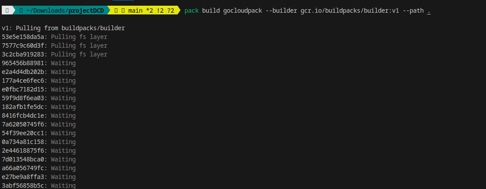

# ST2DCE - DevOps and Continuous Deployment - Project  
**Clorinda NGUOKO - Dieuveille MPOUNKOUO**  

## Part One: Build and Deploy an Application using Docker / Kubernetes and Jenkins Pipeline  

### Architecture Diagram and Tool Chain  
Below is the diagram of our solution, including the toolchain we implemented to achieve full continuous deployment of the application:  

   

Our architecture demonstrates an automated workflow for software development and deployment, commonly referred to as a CI/CD pipeline (Continuous Integration / Continuous Deployment).  

1. **Code Development**:  
   The process begins with the application source code written in **Go**. When a team member pushes code changes to **GitHub**, it triggers the CI/CD pipeline configured in **Jenkins**.  

2. **Continuous Integration via Jenkins**:  
   Jenkins retrieves the code from GitHub, runs unit tests, and, if the tests pass, builds a Docker image containing the updated application.  

3. **Docker Image Creation and Storage**:  
   The Docker image is then pushed to an image registry, such as **Docker Hub**, where it is stored for subsequent use.  

4. **Deployment Orchestration with Kubernetes**:  
   **Kubernetes** handles container orchestration and application deployment. It pulls the Docker image from the registry and deploys it onto a Kubernetes cluster.  

5. **Monitoring and Observability**:  
   - **Prometheus** is used to collect metrics about the state of pods, containers, and the Kubernetes cluster.  
   - **AlertManager**, integrated with Prometheus, generates alerts in case of issues (e.g., a service or pod being offline).  

6. **Visualization with Grafana**:  
   Metrics collected by Prometheus are visualized through **Grafana** dashboards, allowing for easy monitoring and quick decision-making.    

## Customize the application so that the /whoami endpoint displays your team’s name and and deploy it on local docker engine by using Jenkins.

We updated the main.go file by changing the name of the teams members.
```console
package main

import (
	"encoding/json"
	"fmt"
	"log"
	"net/http"
)

type whoami struct {
	Name  string
	Title string
	State string
}

func main() {
	request1()
}

func whoAmI(response http.ResponseWriter, r *http.Request) {
	who := []whoami{
		whoami{Name: "Clorinda NGUOKO & Dieuveille MPOUNKOUO",
			Title: "DevOps and Continous Deployment",
			State: "FR",
		},
	}

	json.NewEncoder(response).Encode(who)

	fmt.Println("Endpoint Hit", who)
}

func homePage(response http.ResponseWriter, r *http.Request) {
	fmt.Fprintf(response, "Welcome to the Web API!")
	fmt.Println("Endpoint Hit: homePage")
}

func aboutMe(response http.ResponseWriter, r *http.Request) {
	who := "EfreiParis"

	fmt.Fprintf(response, "A little bit about me...")
	fmt.Println("Endpoint Hit: ", who)
}

func request1() {
	http.HandleFunc("/", homePage)
	http.HandleFunc("/aboutme", aboutMe)
	http.HandleFunc("/whoami", whoAmI)

	log.Fatal(http.ListenAndServe(":8080", nil))
}
```
To deploy it on our machine we created a Dockerfile

```Dockerfile
FROM golang:1.21.5

RUN mkdir /app

ADD . /app

WORKDIR /app

RUN go build -o main .

EXPOSE 8080

CMD [ "/app/main" ]
```

## Deploy app locally using jenkins
# Setup jenkins

   

  

 

Here is our jenkins pipeline:

```jenkins
pipeline {
    agent any
    environment {
        DOCKER_IMAGE = 'my-go-app'
    }
    stages {
        stage('Clone Repository') {
            steps {
                git branch: 'main', url: 'https://github.com/CloNTCL/projectDCD/'
            }
        }
        stage('Build Docker Image') {
            steps {
                sh 'docker build -t my-go-app .'
            }
        }
        
        stage('Deploy to Local Docker') {
            steps {
                sh 'docker run -d -p 8181:8181 --name go_app my-go-app'
            }
        }
        
        stage('Deploy to Minikube') {
            steps {
                // sh 'eval $(minikube docker-env)'
                // sh 'docker build -t my-go-app .'
                // sh 'minikube image load my-go-app'
                sh 'kubectl apply -f k8s/deployment.yaml'
            }
        }
       
        stage('Deploy to Production') {
            when {
                expression { currentBuild.result == null || currentBuild.result == 'SUCCESS' }
            }
            steps {
                sh 'kubectl apply -f k8s/production-deployment.yaml'
            }
        }
    } // 
} // 

```

App customization displaying our team members' names: 
 

### Update the pipeline to deploy the application on your Kubernetes : without using docker hub

We created 2 files in k8s folder deployment.yaml for the develop deployment and production-deployment for the production deployment

#deployment.yaml

```deployment
apiVersion: apps/v1
kind: Deployment
metadata:
  name: go-app-development
  namespace: dev
spec:
  replicas: 1
  selector:
    matchLabels:
      app: go-app
  template:
    metadata:
      labels:
        app: go-app
    spec:
      containers:
        - name: go-app
          image: efrei2023/my-go-app:latest
          ports:
            - containerPort: 8181
          imagePullPolicy: IfNotPresent  
---
apiVersion: v1
kind: Service
metadata:
  name: go-app-service
  namespace: dev
spec:
  selector:
    app: go-app
  ports:
    - protocol: TCP
      port: 8181
      targetPort: 8181
  type: NodePort
```
#production-deployment.yaml
```production-deployment
apiVersion: apps/v1
kind: Deployment
metadata:
  name: go-app-development
  namespace: prod
spec:
  replicas: 1
  selector:
    matchLabels:
      app: go-app
  template:
    metadata:
      labels:
        app: go-app
    spec:
      containers:
        - name: go-app
          image: efrei2023/my-go-app:latest
          ports:
            - containerPort: 8181
          imagePullPolicy: IfNotPresent  
---
apiVersion: v1
kind: Service
metadata:
  name: go-app-service
  namespace: prod
spec:
  selector:
    app: go-app
  ports:
    - protocol: TCP
      port: 8181
      targetPort: 8181
  type: NodePort
```

We need to update Jenkinsfile

#Jenkinsfile

```Jenkinsfile
pipeline {
    agent any
    environment {
        DOCKER_IMAGE = 'my-go-app'
    }
    stages {
        stage('Clone Repository') {
            steps {
                git branch: 'main', url: 'https://github.com/CloNTCL/projectDCD/'
            }
        }
        stage('Build Docker Image') {
            steps {
                sh 'docker build -t my-go-app .'
            }
        }
        
        stage('Deploy to Local Docker') {
            steps {
                sh 'docker run -d -p 8181:8181 --name go_app my-go-app'
            }
        }
        
        stage('Check Healthy Container') {
            steps {
                sh 'curl http://localhost:8181/whoami'
            }
        }
        
        stage('Create Namespace Dev') {
            steps {
                sh 'kubectl create namespace dev || true' // Évite une erreur si le namespace existe déjà
            }
        }
        
        stage('Create Namespace Prod') {
            steps {
                sh 'kubectl create namespace prod || true'
            }
        }
        
        stage('Deploy to Minikube (Dev)') {
            steps {
                sh 'kubectl apply -f k8s/deployment.yaml -n dev'
            }
        }
        
        stage('Deploy to Minikube (Prod)') {
            steps {
                sh 'kubectl apply -f k8s/production-deployment.yaml -n prod'
            }
        }
       
        stage('Deploy to Production') {
            when {
                expression { currentBuild.result == null || currentBuild.result == 'SUCCESS' }
            }
            steps {
                sh 'kubectl apply -f k8s/production-deployment.yaml -n prod'
            }
        }
    }
}


```
 

Resultats

En dev

 

En prod
 

### . BONUS (+1): Build the docker image using the buildpack utility and describe what you observe in comparison with the Dockerfile option.

First we need to install the buildpack utility in our local machine

(curl -sSL "https://github.com/buildpacks/pack/releases/download/v0.32.1/pack-v0.32.1-linux.tgz" | sudo tar -C /usr/local/bin/ --no-same-owner -xzv pack)

use the command pack builder suggest that tell you what image would be best to use for your code.

pack build gocloudpack --builder http://gcr.io/buildpacks/builder:v1 --path .

 

In the following picture, we see that buildPack allows us to create lighter images compared to Docker

 